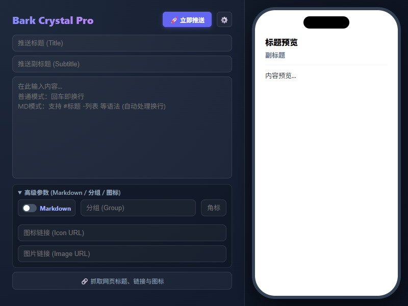

# 💎 Bark-Crystal

> **极简、奢华、高效的 Chrome Bark 推送神器**
>
> *Designed for Perfectionists. @author Yuehuaer*

**Bark Crystal** 是一款专为 iOS Bark App 用户打造的高级 Chrome 扩展。它摒弃了繁杂的设计，采用 **800x600 黄金比例**的“Max Vision”视界，融合深色毛玻璃（Glassmorphism）美学，并内置了智能 Markdown 渲染引擎与自动草稿箱功能，为您提供极致的推送体验。

## ✨ 核心特性 (Core Features)

### 1. 🖥️ Max Vision 沉浸视界
- **零滚动设计**：800x600px 极限物理尺寸，所有控件一目了然，告别繁琐的滚动条。
- **极致紧凑**：精心调校的 UI 间距，让操作流如水般顺滑。

### 2. 📝 Smart MD 智能引擎
- **智能 Markdown 开关**：
  - **开启时 [✅]**：启用“智能换行”模式。您可以像写 Word 一样直接回车，插件会自动将其转换为 Markdown 标准换行符。支持 `# 标题`、`- 列表`、`> 引用` 等语法。
  - **关闭时 [❌]**：纯文本模式（所见即所得），适合发送代码块、表格等对格式要求严格的内容。
- **原生级预览**：右侧内置 iOS 风格手机预览窗，支持灵动岛显示，实时渲染 Markdown 效果（标题加粗、引用块灰底、代码高亮等）。

### 3. 💾 自动草稿箱 (Auto-Save)
- **永不丢失**：无论您是误触关闭窗口，还是切换网页去复制内容，插件都会实时将您的标题、正文、图片链接保存在本地。
- **随时继续**：再次打开插件，一切都在原处，等待您的发送。

### 4. 🖱️ 右键极速提取
- **网页采集**：在网页选中文本 -> 右键点击 **“提取选中文字到 Bark 草稿箱”**。
- **无缝衔接**：内容会自动存入插件，并弹出系统通知。点击插件图标即可进行二次编辑或直接推送。

### 5. 🎨 全参数支持
- 支持 Bark 所有高级参数：`分组 (Group)`、`角标 (Badge)`、`图标 (Icon)`、`图片 (Image)`、`副标题 (Subtitle)`
- 更多参数请查看 [Bark 官方文档](https://bark.day.app/#/?id=bark)，自行更新配置。
- 支持一键抓取当前网页的 **标题**、**链接** 和 **Favicon图标**。

---

## 🚀 安装指南 (Installation)

由于本项目尚未上架 Chrome 商店，请使用“开发者模式”安装：

1. **下载代码**：点击右上角 `Code` -> `Download ZIP` 并解压，或使用 Git 克隆本仓库。
2. **打开扩展管理**：在 Chrome 浏览器地址栏输入 `chrome://extensions/` 并回车。
3. **开启开发者模式**：打开右上角的 **“开发者模式”** 开关。
4. **加载插件**：点击左上角的 **“加载已解压的扩展程序”**。
5. **选择文件夹**：选择包含 `manifest.json` 的 **Bark Crystal** 文件夹。
6. **完成**：现在你应该能在浏览器右上角看到 💎 图标了！

---

## ⚙️ 配置说明 (Configuration)

首次使用请进行简单的服务器配置：

1. 打开插件，点击右上角的 **设置图标 (⚙️)**。
2. **Device Key**：填写你的 Bark App 提供的私钥（必填）。
3. **服务器地址**：
   - 默认为官方地址 `https://api.day.app`
   - 如果你有自建服务器（如 Cloudflare Workers），请填写你的服务器地址。
4. 点击 **“保存配置”**。

---

## 📖 Markdown 使用技巧

| 功能 | 语法示例 | 智能模式表现 |
| :--- | :--- | :--- |
| **一级标题** | `# 标题内容` | 自动加粗、加大、下划线 |
| **列表** | `- 列表项` | 自动处理缩进和圆点 |
| **引用** | `> 引用文本` | iOS 风格灰色竖线背景 |
| **链接** | `[文字](URL)` | 蓝色高亮 |
| **图片** | `` | 在预览区显示缩略图 |
| **换行** | `回车键` | **自动转换为双换行 (推荐开启)** |

---

## ⚠️ 免责声明 (Disclaimer)

**使用本脚本或使用插件即视为您已接受以下所有条款：**

==================================================================

【脚本免责声明】
1. 此插件和脚本仅用于学习研究，不保证其合法性、准确性、有效性，请根据情况自行判断，本人对此不承担任何保证责任。
2. 由于此插件和脚本仅用于学习研究，您必须在下载后 24 小时内将所有内容从您的计算机或手机或任何存储设备中完全删除，若违反规定引起任何事件本人对此均不负责。
3. 请勿将此插件和脚本用于任何商业或非法目的，若违反规定请自行对此负责。
4. 此脚本涉及应用与本人无关，本人对因此引起的任何隐私泄漏或其他后果不承担任何责任。
5. 本人对任何插件和脚本引发的问题概不负责，包括但不限于由插件和脚本错误引起的任何损失和损害。
6. 如果任何单位或个人认为此插件和脚本可能涉嫌侵犯其权利，应及时通知并提供身份证明，所有权证明，我们将在收到认证文件确认后删除此插件和脚本。
7. 所有直接或间接使用、查看此插件和脚本的人均应该仔细阅读此声明, 本人保留随时更改或补充此声明的权利, 一旦您使用或复制了此插件和脚本，即视为您已接受此免责声明。

==================================================================

---

## 🙏 致谢 (Acknowledgements)

本项目引用了以下优秀的开源项目，特此感谢：

* **[marked.js](https://github.com/markedjs/marked)**: 本插件的 Markdown 渲染引擎核心。感谢 marked 团队提供的强大解析库，让这个小插件能拥有如此丰富的文本表现力。

---

## 🐣 作者的话 (Note from Author)

大家好，我是 **@Yuehuaer**。

这是我作为**新手**开发的一个 Chrome 扩展。说实话，GitHub 我还没完全玩明白，很多规范可能也不太懂。做这个插件主要是因为自己用 Bark 时觉得现有的工具都不太顺手，所以就自己动手“搓”了一个。

如果代码写得不够优雅，或者哪里有 Bug，**求各路大神轻喷** 😂。非常欢迎大家提 Issue 或 PR 教我做人（哦不，是教我写代码），我会努力学习改进的！

如果你觉得这个小工具还挺好用，欢迎点一个 ⭐ **Star** 鼓励一下新人，谢谢大家！